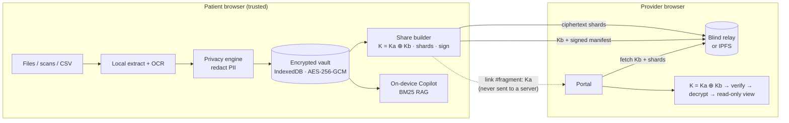

# 🔐 MediKey — Zero-Trust Medical Record Aggregator

> **Your medical history. Your keys. Nobody's server.**
> Aggregate scattered health records, scrub personal identifiers *on your device*, and share with a doctor through a link that **expires**, can be **revoked**, and that the server itself **cannot read**.

MediKey is a decentralized-by-design web app built for the *Zero-Trust Medical Record Aggregator* hackathon problem. Keys are generated in the browser, files are parsed and OCR'd locally, PII is redacted **before** anything is encrypted, and the only server involved is a *blind relay* that stores ciphertext and one useless-on-its-own half of a key.

---

## Contents
1. [Feature map](#feature-map-vs-the-problem-statement)
2. [Quick start](#quick-start)
3. [Demo walkthrough (3 minutes)](#demo-walkthrough)
4. [Architecture](#architecture)
5. [Encryption & sharing protocol](#encryption--sharing-protocol)
6. [Privacy engine](#privacy-engine)
7. [Relay API](#blind-relay-api)
8. [IPFS / decentralized storage](#ipfs--decentralized-storage)
9. [Deployment](#deployment)
10. [Testing](#testing)
11. [Threat model & honest limitations](#threat-model--honest-limitations)
12. [Project layout](#project-layout) · [Future scope](#future-scope)

---

## Feature map vs. the problem statement

| Requirement | Where it lives | Notes |
|---|---|---|
| **Authentication** – client-side cryptographic keys | `src/lib/identity.ts`, `keystore.ts` | 256-bit seed → HKDF → Ed25519 identity + AES-256 vault key. Seed wrapped with **Argon2id** (64 MiB) + AES-GCM. 14-group **recovery key** with checksum. No account, no email, no server. Auto-lock wipes keys from memory. |
| **Document Vault** – PDFs, lab reports, raw text | `src/lib/extract.ts`, `pages/Vault.tsx`, `AddRecord.tsx` | pdf.js text layer, **on-device OCR** (Tesseract WASM bundled locally) for scans/images, TXT, CSV. Per-record AES-256-GCM in IndexedDB, AAD-bound to the record id. |
| **Privacy Engine** – client-side PII redaction before encryption | `src/lib/pii/engine.ts`, `components/RedactionReview.tsx` | Layered detection (see below), per-item review, manual redaction, Balanced vs. **HIPAA Safe-Harbor-style Strict** mode, second-pass leak scan. Original file is discarded. |
| **Access Dashboard** – generate / manage / revoke links | `pages/Access.tsx`, `lib/share.ts` | Live status, countdowns, view counts, access log, QR codes, one-click **revoke**. |
| **Provider Portal** – read-only view for verified professionals | `pages/ProviderPortal.tsx`, `ProviderHome.tsx` | A **patient dashboard**: the doctor pastes one or many patient links and gets a card per patient (live status, expiry countdown, record count, last opened). Records decrypt in the provider's browser, **verify the patient's Ed25519 signature**, and are read-only, watermarked, print-blocked and wiped on expiry. Only links + non-medical metadata are saved — never records. |
| ⭐ **Time-bound access** | `server/index.mjs`, `share.ts` | 1 h – 30 days, optional **view limits / burn-after-reading**. Expiry & revocation *destroy the relay's key-half* → data becomes cryptographically unreadable, not merely hidden. |
| ⭐ **AI Health Copilot** – secure RAG | `src/lib/copilot/*`, `pages/Copilot.tsx` | 100 % on-device: BM25 retrieval over sanitized chunks + medical glossary + lab reference-range engine, with citations. Optional rephrasing by the browser's built-in model (Chrome Prompt API) — still local. **Zero network calls.** |
| ⭐ **Vitals & time-series** | `src/lib/vitals.ts`, `pages/Vitals.tsx` | BP / glucose / wearable CSVs auto-mapped; trend charts with normal bands; **ECG** waveform on paper-style grid with **R-peak detection, HR, HRV (RMSSD/SDNN)**. |
| ⭐ **Decentralized storage** | `src/lib/blobstore.ts`, `scripts/mock-ipfs.mjs` | Encrypted **content-addressed shards** stored on **IPFS** (Kubo API + any gateway) or the relay. The relay never needs to see the data. |

### Beyond the brief (innovation)
* **Split-key sharing** — the grant key is `K = Ka ⊕ Kb`. `Ka` lives only in the URL *fragment* (never sent to any server); `Kb` lives on the relay and is deleted on expiry/revoke. Neither half alone reveals anything.
* **Clinician-bound links** — a provider generates an X25519 key in the portal; the patient binds a link to it (ECIES-style). A leaked URL is then useless.
* **Passcode links** — Argon2id-stretched second factor, checked locally so wrong guesses never burn a view.
* **Signed manifests** — providers cryptographically verify the share came from the patient key it claims.
* **Zero-Trust Ledger** — a live network log proving no plaintext leaves the device, a view of the raw ciphertext a thief would see, and an in-browser crypto self-test.

---

## Quick start

**Requirements:** Node.js ≥ 20 (developed on Node 26) and npm.

```bash
git clone <this repo> medikey && cd medikey
npm install          # also copies the offline OCR engine into public/ocr
npm run dev          # relay on :8787 + web app on :5173  →  open http://localhost:5173
```

Production-style, single process (relay + built app on one port):

```bash
npm run start        # builds, then serves everything on http://localhost:8787
```

Optional IPFS demo without installing IPFS:

```bash
npm run mock-ipfs    # fake Kubo node: API :5001, gateway :8080
# then in the app: Settings → Decentralised storage → IPFS
```

Environment variables (relay): `PORT` (8787), `HOST`, `DATA_DIR` (`./data`), `MAX_TTL_DAYS` (30), `MAX_STORE_MB` (512), `CONNECT_SRC_EXTRA` (extra CSP `connect-src`, e.g. a remote IPFS gateway).
Frontend: `VITE_RELAY_URL` to point a separately-hosted static build at a remote relay.

> The sample documents in `public/samples/` are **entirely synthetic** (regenerate the CSV/PDF with `python3 scripts/make-samples.py`).

---

## Demo walkthrough

1. **Create a vault** on the landing page → keys are generated locally; save the recovery key.
2. **Vault → Add record → "Load all samples at once"** (or pick one to see the review UI — try the *Scanned prescription* to watch on-device OCR).
3. Open a sample manually: watch names, MRN, SSN, Aadhaar, phone, address turn red; toggle **Strict**; select any text to redact it manually; view the **sanitized preview**.
4. **Vitals**: ECG with R-peaks (72 bpm, HRV) and the 45-day BP trend.
5. **Copilot**: *"Which results are abnormal?"*, *"What medicines am I taking?"*, *"What is HbA1c?"*
6. **Sharing → New share link**: select records, choose 24 h / 1 open, optionally passcode or clinician key → copy link / scan QR.
7. Open the link in another tab/browser (**Provider Portal**): signature ✓, countdown, watermark, read-only.
8. Back on the dashboard see **"1 open"** appear, then **Revoke** → provider reload shows *"Access was revoked"*.
9. **Security**: 0 third-party requests, ciphertext-at-rest view, run the crypto self-test.

Bound-key flow: provider opens `/#/provider` → *Generate clinician key* → sends `MKP-…` to the patient → patient picks *Only a verified clinician key*.

---

## Architecture



**Trust boundaries**

| Component | Sees | Cannot |
|---|---|---|
| Patient browser | everything (RAM only while unlocked) | — |
| Relay / IPFS | ciphertext shards, `Kb`, signed manifest, open counter | read data, learn identities, decrypt |
| Provider browser | link half `Ka`, decrypted bundle for the grant | see anything not shared; keep access past expiry |

---

## Encryption & sharing protocol

```
seed (256-bit, random) ──HKDF──▶ vaultKey (AES-256-GCM)   ──▶ encrypts every record (AAD = record id)
                       └─HKDF──▶ Ed25519 keypair           ──▶ signs manifests / revocations
seed ──wrapped by──▶ Argon2id(passphrase, 64 MiB, t=3) + AES-GCM   (only this touches disk)

Share:  K  = random 256-bit              (grant key)
        Ka = random 256-bit              → URL fragment (bearer)  |  Argon2id-wrapped (passcode)  |  X25519-sealed (clinician-bound)
        Kb = K ⊕ Ka                      → relay (deleted on expiry / revoke / last view)
        bundle → gzip → 192 KiB chunks → AES-256-GCM(K, aad = "id:index:total") → shards (SHA-256 addressed)
        manifest {id, Kb, expiry, maxViews, shard hashes} ─Ed25519 sign─▶ relay
Open:   verify signature → K = Ka ⊕ Kb → fetch shards → verify SHA-256 → decrypt → un-gzip
```

Primitives: WebCrypto AES-GCM, `@noble/curves` (Ed25519, X25519), `@noble/hashes` (HKDF, Argon2id, SHA-256). Nothing is hand-rolled.

---

## Privacy engine

Runs entirely in `src/lib/pii/engine.ts` (pure functions, unit-tested).

1. **Structured identifiers** – e-mail, URL, IP, phone (US / intl / India), SSN, Aadhaar, PAN, Luhn-validated cards.
2. **Label-anchored fields** – `Patient Name:`, `MRN`, `UHID`, `Accession`, `Policy/Member/Group no.`, `Address:`, `DOB:` …
3. **Context cues** – `Mr./Mrs./Dr.`, `Dear …`, `<Name> is a 52-year-old`, relationship cues (`his daughter, …`), credentials (`…, MD`).
4. **Propagation** – every other occurrence of a detected name (incl. `SMITH, JOHN`, possessives), plus **your own identifiers** from Settings. Relatives sharing a surname get distinct placeholders.
5. **HIPAA Safe-Harbor extras (Strict)** – dates → year only, ages ≥ 90 → `90+`, clinician & facility names removed.

Each finding has a confidence level; you review them in the UI, can add manual redactions (with "all occurrences"), and a **second-pass scan** re-runs detection over the sanitized output and warns about any residue. Clinical content (labs, doses, vitals) is preserved. It is rule-based and reviewable — *not* a guarantee; see limitations.

---

## Blind relay API

All JSON unless noted. Owner-authenticated calls carry an Ed25519 signature; the relay verifies against the grant's `ownerPub`.

| Method & path | Purpose |
|---|---|
| `PUT /api/blobs/:sha256` | Upload an encrypted shard (raw bytes; body must hash to `:sha256`, ≤ 600 KB) |
| `GET /api/blobs/:sha256` | Download a shard |
| `POST /api/grants` | Register a signed grant `{grant, sig}` (validates schema, expiry ≤ 30 d, shards exist) |
| `GET /api/grants/:id/status` | Non-counting public status probe (no key material) |
| `POST /api/grants/:id/open` | Provider open → counts a view, releases `Kb` + manifest while live; **last permitted view destroys `Kb`** |
| `POST /api/inspect` | Owner (signed, batched) → statuses, view counts, access log |
| `POST /api/grants/:id/revoke` | Owner (signed) → destroys `Kb`, retires shards |
| `GET /api/health` | Liveness |

Hardening: strict CSP, `no-referrer`, per-IP rate limits, size caps, signature timestamps (±5 min), atomic JSON persistence, background sweeper for expiry, no IPs or user agents logged.

---

## IPFS / decentralized storage

Settings → *Decentralised storage* → **IPFS**. Shards are added to a Kubo node (`/api/v0/add?pin=true&cid-version=1`) and fetched by providers through any gateway (`/ipfs/<cid>`), with each shard verified against its signed SHA-256. Because shards are ciphertext and the key-half is held off-IPFS, **publishing to a public network is safe, and revocation is still effective** — once `Kb` is destroyed, even pinned copies are permanently unreadable.

```bash
ipfs daemon &
ipfs config --json API.HTTPHeaders.Access-Control-Allow-Origin '["http://localhost:5173","http://localhost:8787"]'
```
(or use `npm run mock-ipfs`). The relay is still required for `Kb`, the signed manifest, expiry and revocation.

---

## Deployment

**Single container / VM (recommended)** — the relay serves the built app and the API on one origin:

```bash
docker build -t medikey . && docker run -p 8787:8787 -v medikey-data:/app/data medikey
```

**Render / Railway / Fly.io:** create a Web Service from this repo — build `npm ci && npm run build`, start `node server/index.mjs`, attach a small disk at `/app/data` (a `render.yaml` is included). Serve over **HTTPS** (WebCrypto and clipboard require a secure context off `localhost`).

**Static frontend + separate relay:** build with `VITE_RELAY_URL=https://relay.example.org npm run build` and host `dist/` anywhere (Vercel, Netlify, GitHub Pages); the relay allows cross-origin API calls (no cookies/credentials are ever used).

---

## Testing

```bash
npm test            # 37 tests: PII engine, vitals/ECG, copilot, crypto + full share protocol
npm run typecheck
```

The protocol suite boots the real relay in-process and covers: multi-shard round-trip, relay-side plaintext absence, wrong-secret rejection, passcode (no view burned on wrong guess), clinician-bound links, revocation, cross-account revoke/inspect denial, expiry, tamper detection by a malicious relay, and the IPFS path with the mock node.

---

## Threat model & honest limitations

* **Malicious relay** – can deny service; cannot read data. Tampered shards fail hash + GCM checks; forged manifests fail the signature.
* **Leaked bearer link** – equals a leaked key. Use passcode / view limit / clinician binding.
* **Revocation** cannot un-see what a provider already viewed; screenshots can't be prevented (the portal is read-only, watermarked, print-blocked, and wipes on expiry).
* **Provider identity** – clinician keys are self-issued in this prototype. Production would bind them to NPI/hospital-issued verifiable credentials or a DID registry.
* **PII detection** is rule-based and English/US/India-centric; it is designed for human-in-the-loop review, not silent trust. Names without any context cue can be missed — add them under *My identifiers*.
* **Device compromise** (malware, XSS) defeats any browser-based scheme; mitigations: strict CSP, no third-party scripts, auto-lock.
* Keys live in memory while unlocked. The vault is **local-first** — clearing browser data without a backup loses it (export an encrypted backup in Settings; your recovery key restores the *identity*, backups restore the *data*).

---

## Project layout

```
server/index.mjs            blind relay (Express 5) — also serves dist/
scripts/                    make-samples.py · mock-ipfs.mjs · copy-ocr-assets.mjs
public/samples/             synthetic lab reports, discharge summary, PDF, vitals, ECG
src/lib/
  crypto.ts identity.ts keystore.ts vault.ts   keys, AES-GCM, Argon2id, encrypted IndexedDB
  share.ts relay.ts blobstore.ts               split-key protocol, relay client, relay/IPFS shard stores
  pii/engine.ts                                privacy engine
  extract.ts                                   PDF / OCR / text / CSV ingestion
  vitals.ts                                    CSV → series, stats, ECG R-peak/HRV analysis
  copilot/{glossary,labs,rag}.ts               on-device RAG
  netlog.ts selftest.ts                        transparency ledger + crypto self-test
src/pages/                  Landing · Vault · AddRecord · RecordView · Vitals · Copilot · Access · Security · Settings · ProviderHome · ProviderPortal
tests/                      vitest suites
```

## Future scope

* WebAuthn/passkey unlock (PRF extension) in place of a typed passphrase
* Verifiable-credential / NPI-registry backed clinician identity; hospital SSO-less onboarding
* FHIR / HL7 and Apple-Health / Google-Health-Connect importers; DICOM thumbnails
* Local LLM (WebLLM / Chrome built-in AI) for richer Copilot generation with the same retrieval layer
* Encrypted multi-device sync over IPFS/Ceramic with CRDT merge; Shamir-split social recovery of the seed
* Federated, k-anonymous research cohorts: differential-privacy-noised aggregates from consenting vaults
* Smart-contract anchored consent receipts (tamper-evident audit trail)

*Prototype for a hackathon — synthetic data only; not a medical device and not a substitute for professional medical advice.*
